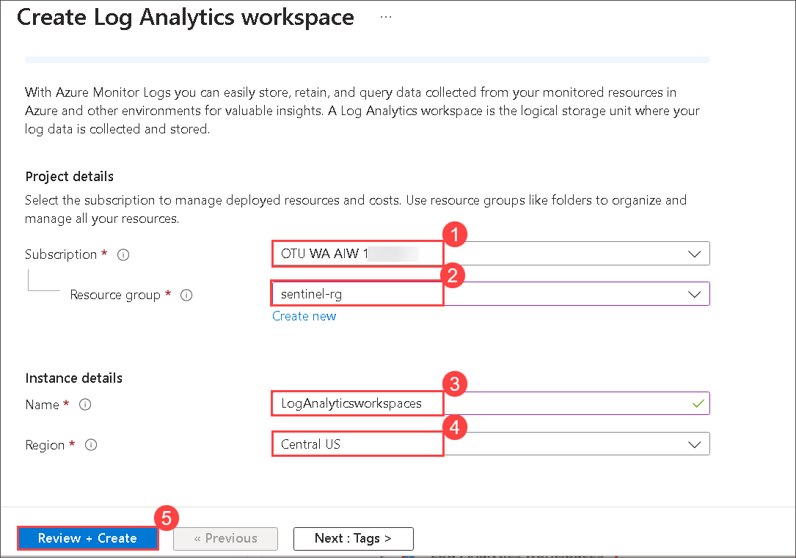
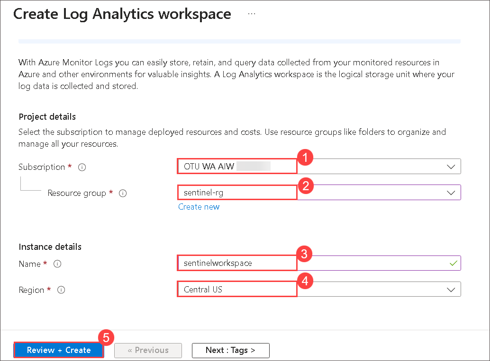
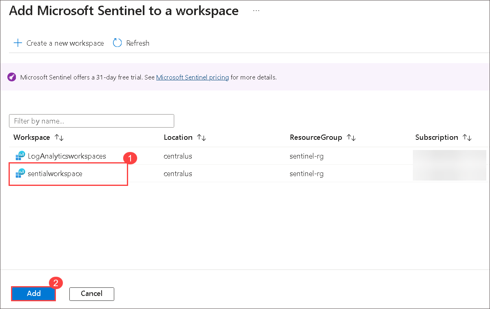

## Lab 01 - Setup Sentinel Workspace

## Lab overview
In the initial phase of setting up the security infrastructure, the focus is on creating essential components to monitor and analyze security events. This involves creating a Log Analytics workspace and a Microsoft Sentinel workspace, laying the foundation for subsequent security measures.

## Lab scenario

In this lab, you will undertake the essential task of setting up Log Analytics provides a centralized location to store and query data, while Sentinel serves as the platform for advanced security analysis. These workspaces enable proactive threat detection and incident response.

## Lab objectives ( Duration: 30 minutes)
In this lab, you will complete the following tasks:
- Task 1: Create a Log Analytics Workspace
- Task 2: Create Sentinel Workspace

## Architecture Diagram

### Task 1: Create a Log Analytics Workspace

In this task, you will create a Log Analytics workspace for use with Microsoft Defender for Cloud.

1.  On Azure Portal page, in **Search resources, services and docs (G+/)** box at the top of the portal, enter **Log Analytics workspaces**, and then select **Log Analytics workspaces** under services.
 
     

1. Select **+ Create** from the command bar.
    
    

1. From the basics tab of the Create Log Analytics workspace, enter the following and Select **Review + Create**.

    | Setting | Action |
    | -- | -- |
    | Subscription |  **Select the given subscription (1)**  |
    | Resource group | select ResourceGroup(sentinel-rg) |
    | Name | **LogAnalyticsworkspaces** |
    | Region | leave this default |
    |||

    

1. Once the workspace validation has passed, select **Create**. Wait for the new workspace to be provisioned, this may take a few minutes.

   

### Task 2: Create Sentinel Workspace

In this task, you will create Microsoft Sentinel workspace where you will be monitoring and analyzing security events in upcoming labs.

1.  On Azure Portal page, in **Search resources, services and docs (G+/)** box at the top of the portal, enter **Microsoft Sentinel**, and then select **Microsoft Sentinel** under services.

    

1. From the Microsoft Sentinel page, select **+ Create**.

1. From Add Microsoft Sentinel to a workspace, select **+ Create a new workspace**.

1. From the basics tab of the Create Log Analytics workspace, enter the following and click **Review + Create**.   

    | Setting | Action |
    | -- | -- |
    | Subscription |  **Select the given subscription (1)**  |
    | Resource group | select ResourceGroup(sentinel-rg) |
    | Name | sentinelworkspace |
    | Region | leave this default |
    |||

    

1. Verify the information you entered then select **Create**.

1. If you don’t see the new workspace listed, select **Refresh**, then select newly created workspace **sentinelworkspace** and click on **Add**.

   

1. Once the new workspace is added, the Microsoft Sentinel | News & guides page will display., including that the Microsoft Sentinel free trial is activated. Select **OK**  Note the three steps listed on the Get started page.

   
   
   

1. Keep this page open, as you will use it in the next task.

### Conclusion

Upon completing these tasks, the organization now possesses the necessary infrastructure to monitor and respond to security events. Log Analytics and Sentinel workspaces are essential tools for maintaining a secure environment in the dynamic landscape of cloud computing.
 
## Review
In this lab, you will complete the following tasks:
- Create a Log Analytics Workspace
- Create Sentinel Workspace
