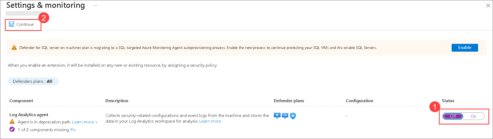
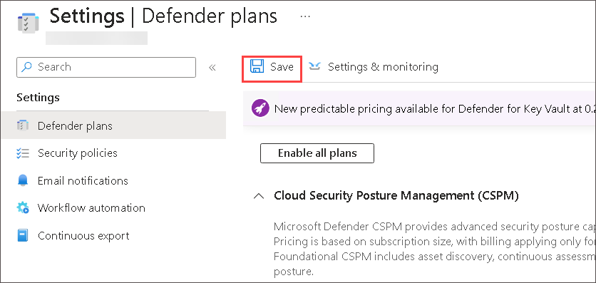

## Lab 02 - Enabling Microsoft Defender for Cloud

## Lab scenario
In this lab, you will setup Log ingestion from Microsoft Defender for Endpoint is to collect, process, and analyze security event logs from Microsoft Defender for Endpoint to enhance threat detection and response within the organization.

## Lab objectives (Duration: 120 minutes)

In this lab, you will complete the following tasks:

## Architecture Diagram

### Task 1: Enabling Microsoft Defender for Cloud
In this exercise, you will be getting started with the functionality of Microsoft Defender for Cloud and how to enable Microsoft Defender for Cloud on a subscription.

1.  On Azure Portal page, in **Search resources, services and docs (G+/)** box at the top of the portal, enter **Microsoft Defender for Cloud**, and then select **Microsoft Defender for Cloud** under services.

    

1. From left navigation menu and click on **Getting started**.

1. On the **Getting Started** page, under the **Upgrade** tab, make sure your subscription is selected and then select the **Upgrade** button at the bottom of the page.

    

1. From the left menu, select **Environment settings** under **Management** section and select the subscription.

     

1. Review the Azure resources that are now protected with the Defender for Cloud plans.

1. Click on **Defender Plans** on left blade. Then you need to click on **Settings&Monitoring** inbetween the page at top left.

    

1. Review the monitoring extensions ,Confirm that **Log Analytics agent/Azure Monitor agent** is **Off**  and press **continue** on the top of right side
   
   
    
1. Back on **Settings | Defender plans** blade and click on **Save**.

    

1. To go back to the **Environment settings** and  Close the **Settings | Defender plans** blade by selecting the 'X' on the upper right of the page.

1. Back on **Environment settings** page expand subscription and Select the Log Analytics workspace you created earlier **sentinelworkspace** to review the available options and pricing.

1. Select **Enable all plans** for  services (**servers**) which you want to onboard (to the right of Select Defender plan) and then select **Save**. Wait for the **"Microsoft Defender plan for workspace LogAnalytics-workspace- was saved successfully!"** notification to appear.

   

   >**Note:** If the page is not being displayed, refresh your Edge browser and try again and if Plans are already enable no need to change anything.
   
   >**Note:** Skip this step if services already enabled
   
1. Close the Defender plans page by selecting the 'X' on the upper right of the page to go back to the **Environment settings**

### Onboard Servers to Defender for Cloud  
After you connect Defender for Cloud to your Azure subscription, you can start connecting your on-premises machines from the Getting started page in Defender for Cloud.

1.  On Azure Portal page, in **Search resources, services and docs (G+/)** box at the top of the portal, enter **Microsoft Defender for Cloud**, and then select **Microsoft Defender for Cloud** under services.

1. On the Defender for Cloud menu, select Getting started.

1. Select the Get started tab.

1. Find Add non-Azure servers and select Configure.

1. Select sentialworkspace Log Analytics workspaces that appears.

1. From the list of workspaces, select Upgrade for the relevant workspace to turn on Defender for Cloud paid plans for 30 free days.

1. From the list of workspaces, select Add Servers for the relevant workspace.

1. On **sentinelworkspace | Agents management** page, expand **Log Analytics agent instructions** copy the Workspace ID and Primary key in notepad you needs this values in next step.

   >**Note**: When you add a Windows server, you need to get the information on the Agents management page and download the appropriate agent file

1. Click on **Download Windows Agent(64 bit)** link.

1. Open downloaded **MMASetup-AMD64.exe** file

1. On **Welcome to the Microsoft Monitoring Agent Setup Wizard** window, click **Next**.

1. On the **Important Notice** window, click **I Agree**.

1. On **Destination Folder** window, click **Next**.

1. On **Agent Setup Option** window select the option **Connect the agent to Azure Log Ananlytics(OMS)**.

1. On **Azure Log Analytics** window, Paste Workspace ID and Primart Key and click **Next** > **Install**.

1. On **Microsoft Monitoring Agent configuration completed successfully**, click finish.

1. From the start menu  search and select **Control panel** then select **System and Security**.

1. Select **Microsoft Monitoring Agent** and on **Microsoft Monitoring Agent properties** window. You can review your configuration there and verify that the agent is connected.

## Review
In this lab, you will complete the following tasks:
