## Lab 03 - Configuration and Management of Microsoft Defender for Endpoint

## Lab scenario

You are a Security Operations Analyst working at a company that is implementing Microsoft Defender for Endpoint. Your manager plans to onboard a few devices to provide insight into required changes to the Security Operations (SecOps) team response procedures.

You start by initializing the Defender for the Endpoint environment. Next, you onboard the initial devices for your deployment by running the onboarding script on the devices. You configure security for the environment. Lastly, you create Device groups and assign the appropriate devices.

>**Note**: Defender for Endpoint is a comprehensive solution for preventing, protecting, from, detecting, and automating the investigation of and response to threats on endpoints. It's a core part of Microsoft 365 Defender, which combines and orchestrates the capabilities of Defender for. Endpoint Defender for Office 365, Defender for Identity and Defender for Cloud apps. Several components defined Defender for endpoint.

## Lab objectives (Duration: 60 minutes)
In this lab, you will perform the following:
- Task 1: Preparing the Microsoft Defender workspace
- Task 2: Initialize Microsoft Defender for Endpoint
- Task 3: Onboard a Device
- Task 4: Configure Roles
- Task 5: Configure Device Groups

## Architecture Diagram

  

### Task 1: Initialize Microsoft Defender for Endpoint

In this task, you will perform the initialization of the Microsoft Defender for the Endpoint portal.

1. In the Edge browser on the Lab VM, navigate to the Microsoft Defender portal at (https://security.microsoft.com) and log in using the provided credentials.

   - Email/Username: <inject key="AzureAdUserEmail"></inject> and then select Next.

   - Password: <inject key="AzureAdUserPassword"></inject> and then select **Sign in**.

      **Note**: Close **Your new Office 365 protection home** window popup.

3. On the **Microsoft Defender** portal, from the navigation menu, select **Settings** .

   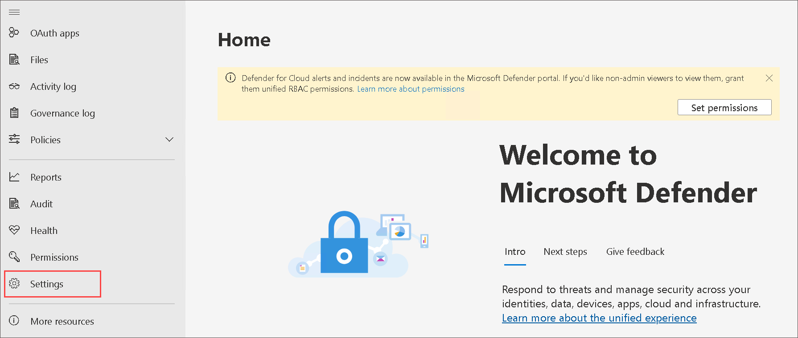

1. On the **Settings** page select **Device discovery**. 

    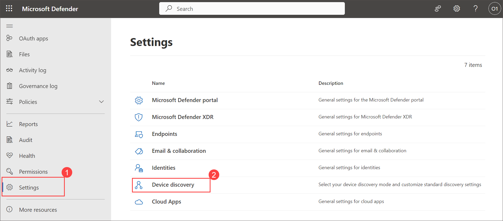

    >**Note:** If you do not see the **Device discovery** option under **Settings**, it may take  1 - 2 hours to reflect so kindly procced with next task and come back after performing next tasks and log out by selecting the top-right circle with your account initials and select **Sign out** and **Sign in** perform this task. 

1. In the Discovery setup make sure **Standard discovery (recommended)** is selected. 
    >**Hint:** If you do not see the option, refresh the page.

     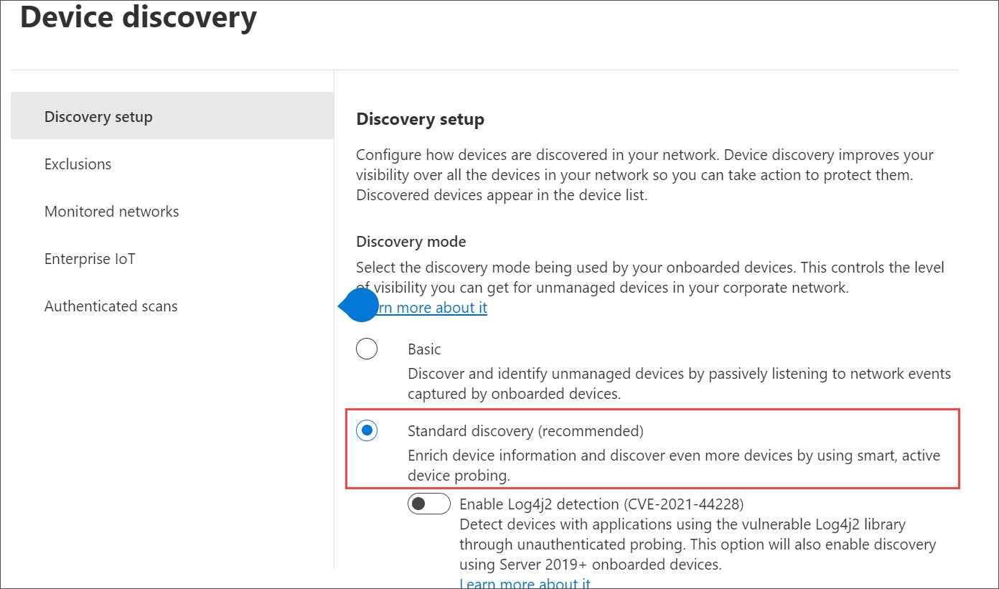
   
### Task 2: Onboard a Device

In this task, you will onboard a device to Microsoft Defender for Endpoint using an onboarding script.

1. In Microsoft Defender portal in your browser.

1. Select **Settings** from the left menu bar, then from the Settings page select **Endpoints**.

    

1. Select **Onboarding** in the Device Management section.

    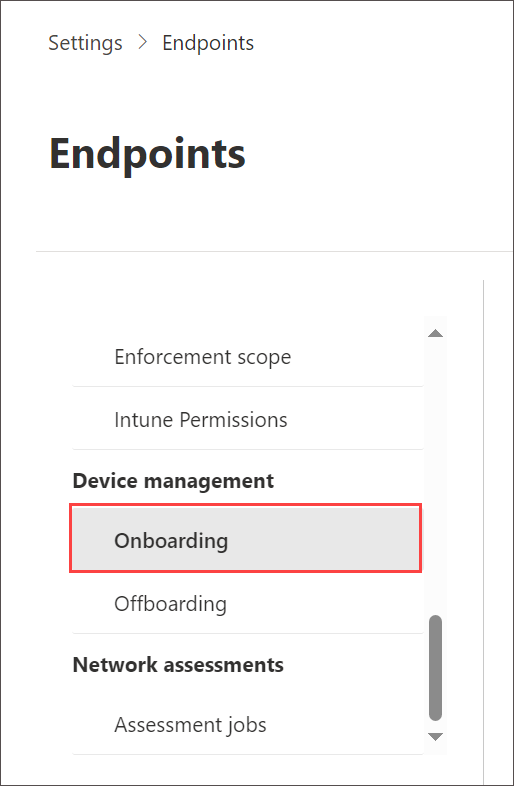

    >**Note:** You can also perform device onboarding from the **Assets** section of the left menu bar. Expand Assets and select Devices. On the Device Inventory page, with Computers & Mobile selected, scroll down to **Onboard devices.** This takes you to the **Settings > Endpoints** page.

1. In the "1. Onboard a device" area make sure "Local Script (for up to 10 devices)" is displayed in the Deployment method drop-down and select the **Download onboarding package** button. 

    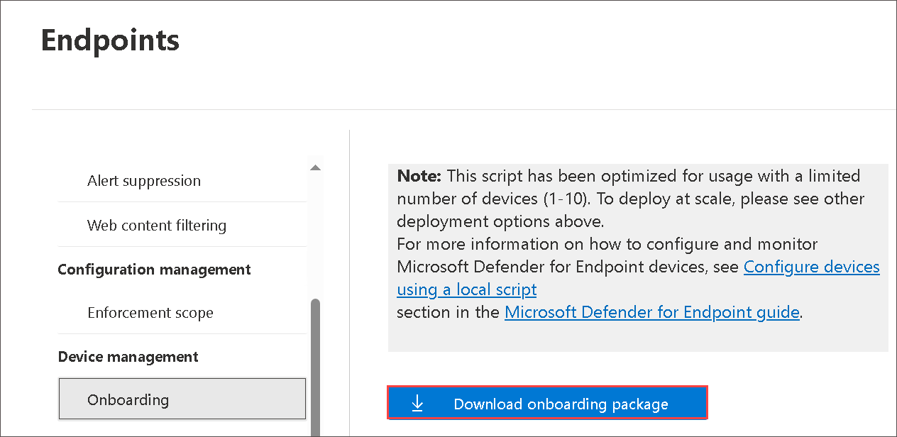
   
1. Under the *Downloads* pop-up, highlight the "WindowsDefenderATPOnboardingPackage.zip" file with your mouse and select the folder icon **Show in folder**. **Hint:** In case you don't see it, the file should be in the c:\users\demouser\downloads directory.

1. Right-click the downloaded zip file and select **Extract All...**, make sure that **Show extracted files when complete** is checked and select **Extract**.

1. Right-click on the extracted file "WindowsDefenderATPLocalOnboardingScript.cmd" and select **Properties**. Select the **Unblock** checkbox in the bottom right of the Properties windows and select **OK**.

    

1. Right-click on the extracted file **WindowsDefenderATPLocalOnboardingScript.cmd** again and choose **Run as Administrator**.

   **Hint:** If you encounter the Windows SmartScreen window, select on **More info**, and choose **Run anyway**. 
    
1. If **User Account Control** window is prompted, select **Yes** to allow the script to run.

1. Enter **Y** to the question presented by the script and press **Enter**. When complete you should see a message in the command screen that says **Successfully onboarded machine to Microsoft Defender for Endpoint**.

   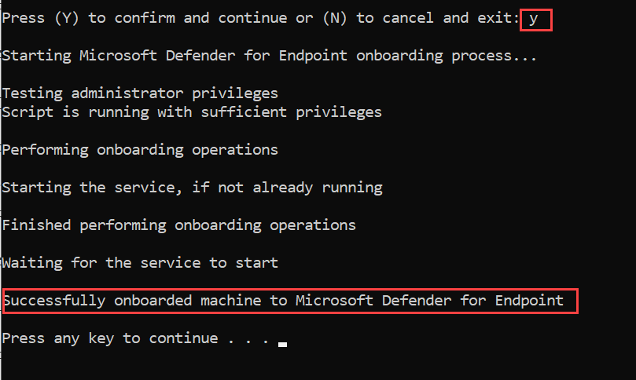
   
1. Press any key to continue. This will close the Command Prompt window.

1. Back in the Onboarding page from the Microsoft Defender portal, under the section "2. Run a detection test", copy the detection test script by selecting the **Copy** button.

    

1. In the windows search bar of the virtual machine, type **CMD** and choose **Run as Administrator** on the right pane for the Command Prompt app. 

1. When the "User Account Control" window is shown, select **Yes** to allow the app to run. 

1. Paste the script by right-clicking in the **Administrator: Command Prompt** windows and press **Enter** to run it.

   **Note:** The window closes automatically after running the script.

1. In the Microsoft Defender portal, in the left-hand menu, under the **Assets** area, select **Devices**. If the device is not shown, complete the next task and come back to check it back later. It can take up to 60 minutes for the first device to be displayed in the portal.

     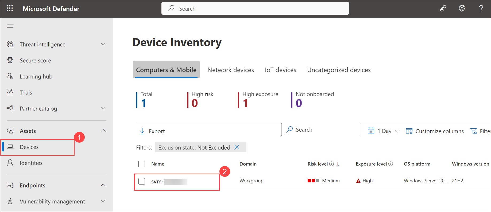

    >**Note:** If you have completed the onboarding process and don't see devices in the Devices list after an hour, it might indicate an onboarding or connectivity problem.

    >**Note**: This task guides participants through the process of onboarding a device to Microsoft Defender for Endpoint using an onboarding script. It ensures that the device is effectively connected and capable of running detection tests.

### Task 3: Configure Roles

In this task, you will configuring roles for use with device groups, enhancing access control and automation capabilities.

1. Navigate back to **Azure Portal** [Azure portal](https://portal.azure.com).

1. In the Search bar of the Azure portal, type **Microsoft Entra ID**, then select Microsoft Entra ID.

1. Select **Groups** and then click on **New group**.

1. Enter the below details for the New group page:

    |Setting|Value|
    |---|---|
    |Group Type| **Microsoft 365** |
    |Group Name| **Sg-IT** |
    |Azure AD roles can be assigned to the group| **Yes** |

1. Click on **No owners selected** and select the **ODL_user** from the list and then click on **select**.

1. Click on **No members selected** and select the **ODL_user** from the list and then click on **select**.

   **Note**: Make sure you have selected **Group type** as Microsoft 365.

1. Select **Create** and click on **Yes**. 

1. Reture back to browser displaying **Microsoft Defender** portal and from left navigation pane select **Settings**, then select **Endpoints**. 

    .png)

1. Select **Roles** under the permissions area and click on **Ture on roles**.

   >**Note**: Please proceed with your tasks without waiting. It may take 1 - 2 hours to reflect, kindly procced with tasks and come return after completing all the labs and perform this task.
   
    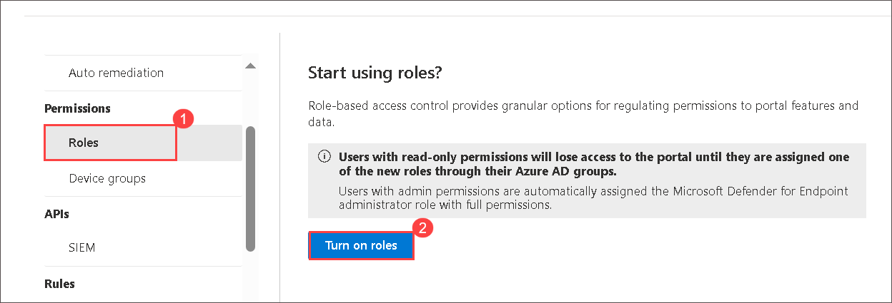

1. Select **+ Add role**
 
   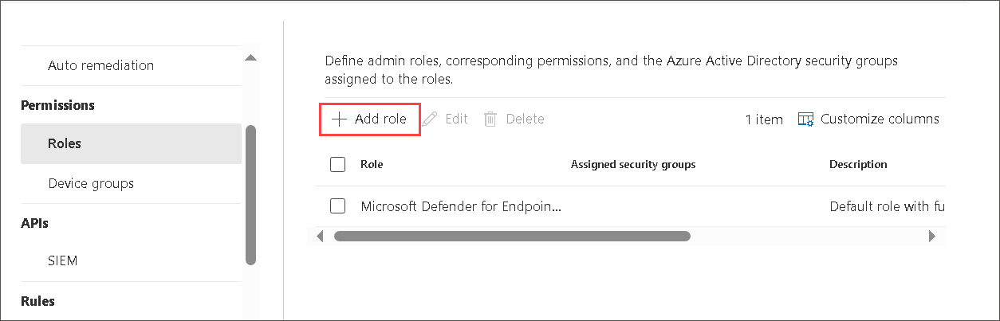

1. In the Add role dialog enter the following:

    |General setting|Value|
    |---|---|
    |Role name|**Tier 1 Support**|
    |Permissions|Select Live Response capabilities - Advanced|

1. Select the **Assigned user groups** by click on next. Select **sg-IT** and then select **Add selected groups**. Make sure it appears under *Azure AD user groups with this role*.

   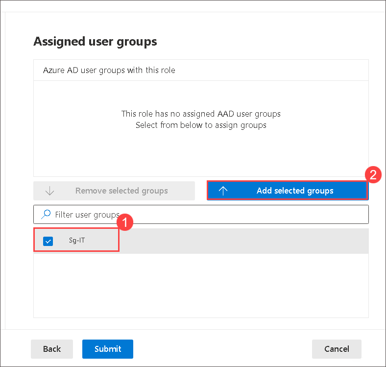

1. Select **sg-IT** and click on **Submit**, Done. If you receive an error while saving the role, refresh the page and try again.

   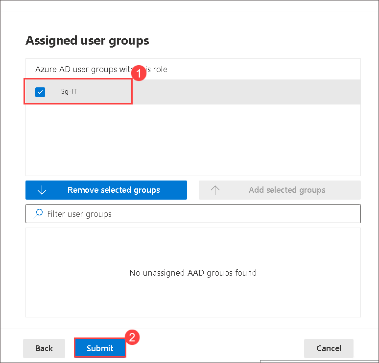

### Task 4: Configure Device Groups

In this task, you will configure device groups to facilitate access control and automation configuration. It ensures effective grouping and remediation of devices.

 >**Note**: Please proceed with your tasks without waiting. It may take 1 - 2 hours to reflect, kindly procced with tasks and come return after completing all the labs and perform this task.

1. In the Microsoft Defender portal select **Settings** from the left menu bar, then select **Endpoints**. 

1. Select **Device groups** under the permissions area and click on  **+ Add device group** icon.
   
   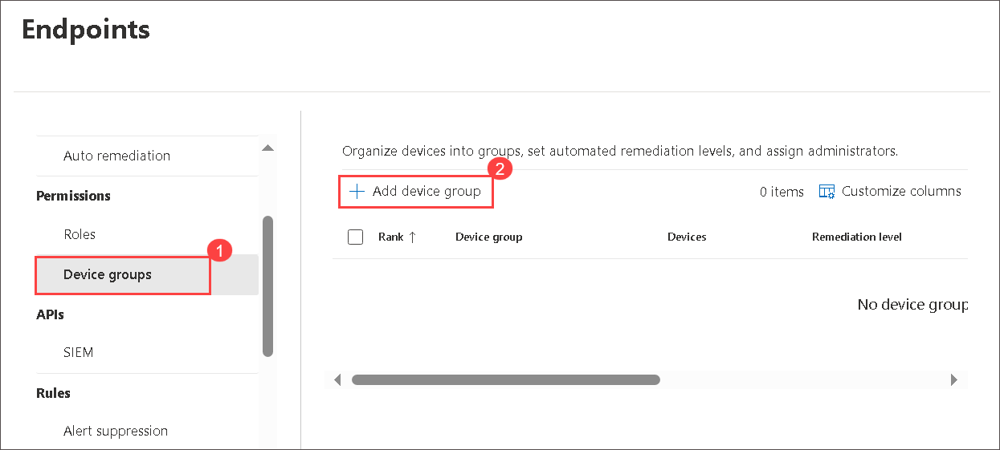
   
1. Enter the following information on the General tab and click on **Next**.

    |General setting|Value|
    |---|---|
    |Device group name|**Regular**|
    |Remediation level| Full-remediate threats automatically|
    |||

    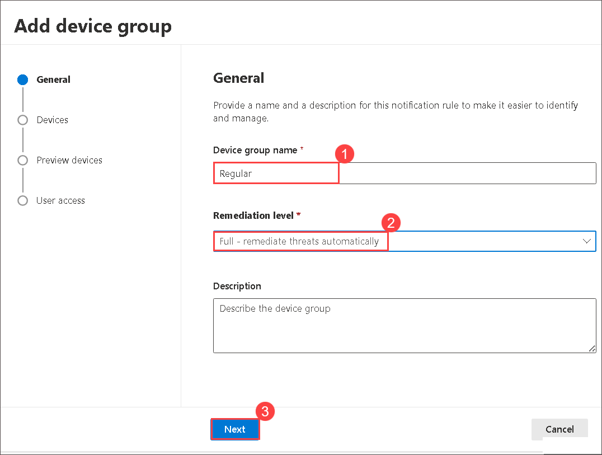

1. On the Devices tab, for the OS condition select **Windows 10** and select **Next**.

    

1. On the Preview devices tab, select **Next**.

    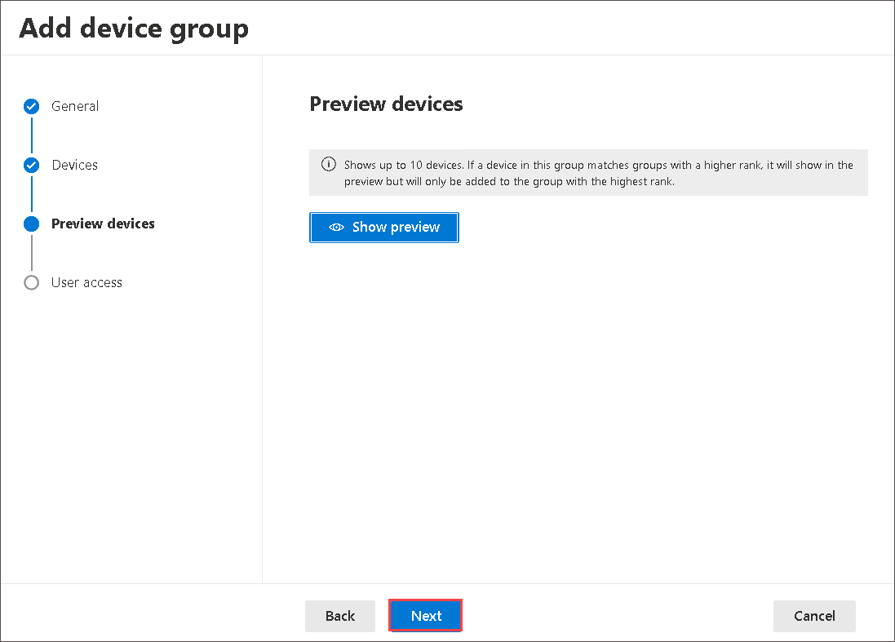

1. For the User access tab, select **sg-IT** and then select **Add selected groups** button. Make sure it appears under **Azure AD user groups with access to this device group**.

    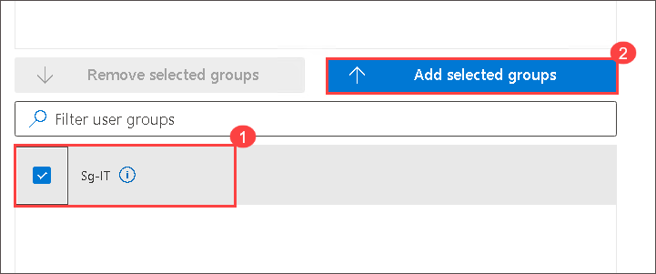

1. Select **sg-IT** and click on **submit**

    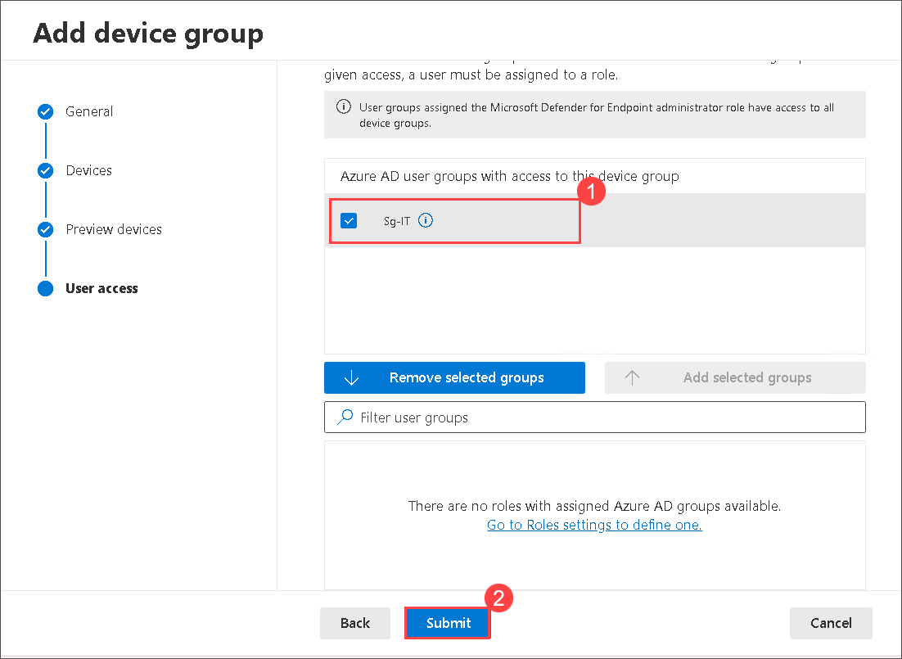

1. Select **Done**.

1. Device group configuration has changed. Select **Apply changes** to check matches and recalculate groupings.

1. You are going to have two device groups now; the **Regular** you just created and the **Ungrouped devices (default)** with the same remediation level.

   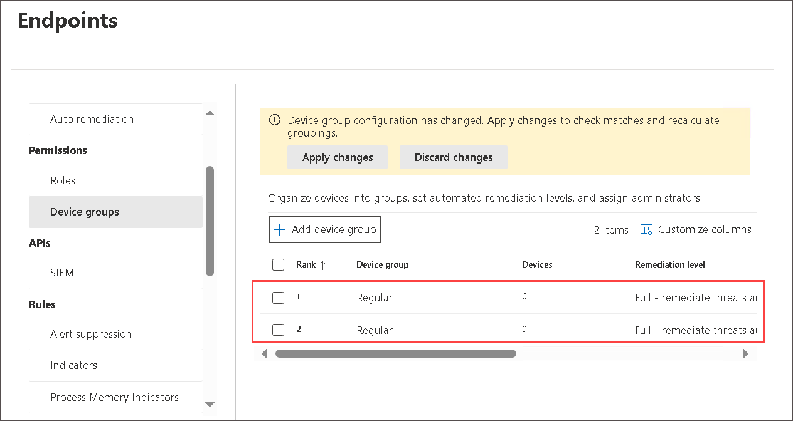

## Review
In this lab, you will perform the following:
- Preparing the Microsoft 365 Defender workspace
- Initialize Microsoft Defender for Endpoint
- Onboard a Device
- Configure Roles
- Configure Device Groups
