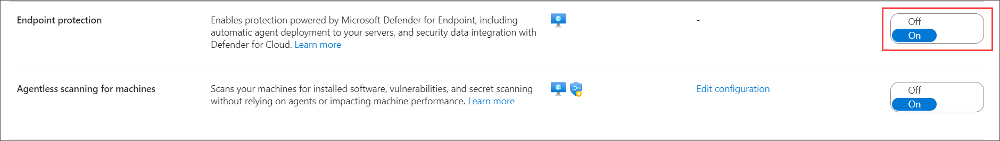

## Lab 05 - Ingest Logs from Microsoft Defender for Endpoint

## Lab overview
This lab focuses on enhancing the security capabilities by enabling Microsoft Defender for Cloud to monitor events and ingest logs into Azure Sentinel. The objective is to strengthen threat detection, response, and analysis within the Azure environment.

## Lab scenario
Microsoft Defender for Endpoint is an enterprise endpoint security platform designed to help enterprise networks prevent, detect, investigate, and respond to advanced threats. In this lab, Ingest Logs from Microsoft Defender for Endpoint is to collect, process, and analyze security event logs from Microsoft Defender for Endpoint to enhance threat detection and response within the organization.

## Lab objectives (Duration: 120 minutes)

In this lab, you will complete the following tasks:
- Task 1: Explore defender for ingest data
- Task 2: Verify installation of Defender for Endpoint on a machine
- Task 3: Ingesting data to Sentinel from Microsoft Defender

## Architecture Diagram

   

### Task 1: Explore defender for ingest data 

In this task, you will explore ingesting logs from Microsoft Defender for Cloud.

1. On Azure Portal page, in **Search resources, services and docs (G+/)** box at the top of the portal, enter **Microsoft Defender for Cloud**, and then select **Microsoft Defender for Cloud** under services.

1.  From **Microsoft Defender for Cloud | Overview** blade, under **Management** section select **Environment settings** and click on the **subscription**.

     

1. Click on **Defender Plans** on left blade, then  click on **Settings&Monitoring** inbetween the page at top left.

    

1. In the status of the Endpoint protection component, select **On** to enable the integration with Microsoft Defender for Endpoint. If its already enable then no need to change.

   
   
   > Automatically onboard your Windows machines to Defender for Endpoint, Detect any previous installations of Defender for Endpoint and reconfigure them to integrate with Defender for Cloud.Onboarding might take up to 1 hour.

1. Select Continue and Save to save your settings.

### Task 2: Verify installation of Defender for Endpoint on a machine

1. From the start menu search and select the **Services**, will find Microsoft Monitoring Agent is Running.

   

   >**Note**: This may take 1 - 2 hours, please proceed to the next task. You can return to this step later to verify.

### Task 3: Ingesting data to Sentinel from Microsoft Defender for Endpoint 

1. On Azure Portal page, in **Search resources, services and docs (G+/)** box at the top of the portal, enter **Microsoft Sentinel**, and then select **Microsoft Sentinel** under services.

1. On **Microsoft Sentinel** blade, click on **sentinelworkspace**, to ingest Microsoft Defender data into Sentinel, you need to utilize the connectors provided by 
   Sentinel.

1. From the left navigation pane select **Data connectors** under **Configuration** section and click on **Go to content hub**.
   

1. Search and select the Microsoft Defender for Endpoint and click on install to get the logs into the Sentinel.

   

1. Back on **Microsoft Sentinel | Data connectors** page and from left navigation pane select **Analytics** under **Configuration** section.

1. Click on **Analytics** under **Configuration** section, to setup a analytics rule to get alerts as a incident in the Sentinel and under **Rule templates** tab search 
   for **Microsoft Defender for Endpoint** and click  **Create rule**.
   
   

1. Click on **Automated response** then **Review + create** and click on **Save**. This will create an alert rule.

1. Now you will be able to see the incidents generated by the Microsoft Defender for Endpoint in **incidents** tab once you setup an alert rule.

    >**Note**: It will take 1 - 2 hours to generate the incidents please procced with next exercise. You can visit this step later and verify.   

      

## Review
In this lab, you will complete the following tasks:
- Explore defender for ingest data
- Verify installation of Defender for Endpoint on a machine
- Ingesting data to Sentinel from Microsoft Defender for Endpoint
