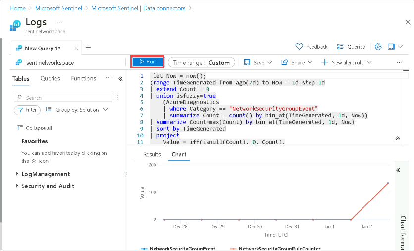

## Lab 08 - Ingest Logs from Azure Network security Groups

## Lab scenario

A network security group contains security rules that allow or deny inbound network traffic to, or outbound network traffic from, several types of Azure resources. In this lab, you configure the integration of Network security group logs with a Security Information and Event Management (SIEM) system to enable thorough security monitoring and analysis.

When you enable logging for an NSG, you can gather the following types of resource log information:

  * **Event**: Entries are logged for which NSG rules are applied to VMs, based on MAC address.
  * **Rule counter**: Contains entries for how many times each NSG rule is applied to deny or allow traffic. The status for these rules is collected every 300 seconds.

This connector lets you stream your NSG diagnostics logs into Microsoft Sentinel, allowing you to continuously monitor activity in all your instances.

## Lab objectives (Duration: 45 minutes)
In this lab, you will complete the following tasks:
- Task 1: Install Azure Network security Groups data connector to Sentinel
- Task 2: Set up the data connector to ingest logs to workspace
- Task 3: View data ingested into Microsoft Sentinel

## Architecture Diagram

   

### Task 1: Install Azure Network Security Groups data connector to Sentinel 

In this task, you will explore the Microsoft Sentinel .

1. On Azure Portal page, in **Search resources, services and docs (G+/)** box at the top of the portal, enter **Microsoft Sentinel**, and then select **Microsoft Sentinel** under services.
   
   

1. Select  **sentinelworkspace**.

1. Select the **Data Connectors** under **Configuration** and select **Go to content hub**.
 
       

1. Search for and select the **Azure Network Security Groups** connector.

   

1. Click on **Install**.

### Task 2: Set up the data connector to ingest logs to workspace

1. In Microsoft Sentinel, select Data connectors.

1. Search for and select the **Network Security Group** connector.

1. In the details pane for the connector, select Open connector page.

1. Review the instructions to configure the connector.

1. Select **Launch Azure Policy Assignment Wizard**.

1. On the **Basics** tab, set the **Scope** to the subscription and resource group that has activity to send to Microsoft Sentinel. Select the existing subscription available.

1. Select the **Parameters** tab.

1. Set the Primary Log Analytics workspace. This should be the workspace where Microsoft Sentinel is installed. In our case, select **sentinelworkspace**.

1. Select the **Remediation** tab and mark the Create a remediation task checkbox.

1. Select Review + create and Create.

  >**Note**: Wait for atleast 15 mins and proceed to next task.

### Task 3: View data ingested into Microsoft Sentinel

1. In Microsoft Sentinel, select Data connectors.

1. Search for and select the **Network Security Group** data connector.

1. In the details pane for the connector, select Open connector page.

1. Review the Status of the data connector. It should be Connected.

1. Scroll down and select **Go to log analytics**.

1. In the query pane, run the following query to view the activity data ingested into the workspace.
   
   
    
## Review
In this lab, you have completed Ingesting logs from Azure Network security Groups to Sentinel.
