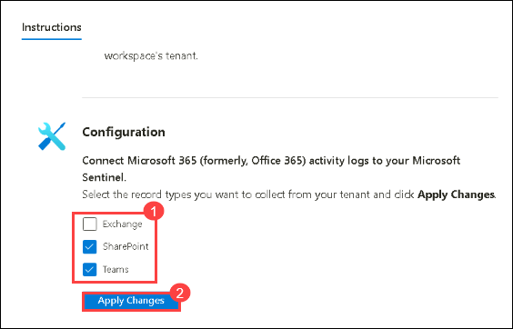

## Lab 09 - Ingest Logs from Microsoft 365

## Lab scenario

The Microsoft 365 (formerly, Office 365) activity log connector provides insight into ongoing user activities. It will provide the details of operations such as file downloads, access requests sent, changes to group events, set-mailbox and details of the user who performed the actions.

In this lab, you will set up log ingestion from Microsoft 365 into a SIEM (Security Information and Event Management) solution for security monitoring and analysis, to view dashboards, create custom alerts, and improve your investigation process.​

## Lab objectives (Duration: 45 minutes)
In this lab, you will complete the following tasks:
- Task 1: Install Microsoft 365 (formerly, Office 365) data connector to Sentinel
- Task 2: Set up the data connector to ingest logs to workspace
- Task 3: View data ingested into Microsoft Sentinel

## Architecture Diagram

   

### Task 1: Install Microsoft 365 (formerly, Office 365) data connector to Sentinel

In this task, you will explore the Microsoft Sentinel .

1. On Azure Portal page, in **Search resources, services and docs (G+/)** box at the top of the portal, enter **Microsoft Sentinel**, and then select **Microsoft Sentinel** under services.
     

1. Select **sentinelworkspace**.

1. Select the **Data Connectors** under **Configuration** and select **Go to content hub**.

       

1. Search for and select the **Microsoft 365** connector. Select the AD connector.

   

1. Click on **Install**.

1. Back on **Microsoft Sentinel | Data connectors** page and from left navigation pane select **Analytics** under **Configuration** section.
   
1. Now you need to setup a analytics rule to get alerts as a incident in the Sentinel, under **Rule templates** tab search for **Microsoft 365** and click on **Create rule**.
   
1. Click on **Automated response** then **Review + create** and click on **Save**. This will create an alert rule.
   
1. Now you will be able to see the incidents generated by the Microsoft 365 in **incidents** tab once you setup an alert rule.
   >**Note**: This may take 1 - 2 hours of time to generate **incidents**, please proceed to the next task. You can return to this step later to verify.

   

### Task 2: Set up the data connector to ingest logs to workspace

1. In Microsoft Sentinel, select Data connectors.

1. Search for and select the **Microsoft 365 (formerly, Office 365)** connector.

1. In the details pane for the connector, select Open connector page.

1. On the **Instructions** page, under configuration, select the required record types data to be collected and click on **Apply changes**

   

  >**Note**: Wait for atleast 15 mins and proceed to next task.

### Task 3: View data ingested into Microsoft Sentinel

1. In Microsoft Sentinel, select Data connectors.

1. Search for and select the **Microsoft 365 (formerly, Office 365)** data connector.

1. In the details pane for the connector, select Open connector page.

1. Review the Status of the data connector. It should be Connected.

1. Scroll down and select **Go to log analytics**.

1. In the query pane, run the default query generated to view the activity data ingested into the workspace.
   
## Review
In this lab we have completed Ingesting logs from Microsoft 365 to Sentinel.
