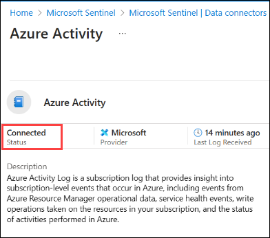

## Lab 10 - Ingest Logs from Microsoft Azure Activity

## Lab scenario

Azure Activity Log is a subscription log that provides insight into subscription-level events that occur in Azure, including events from Azure Resource Manager operational data, service health events, write operations taken on the resources in your subscription, and the status of activities performed in Azure. 

In this lab, you will configure the integration of Microsoft Azure Activity logs with a Security Information and Event Management (SIEM) system to enable thorough security monitoring and analysis.

## Lab objectives (Duration: 45 minutes)
In this lab, you will complete the following tasks:
- Task 1: Install Azure Activity data connector to Sentinel
- Task 2: Set up the data connector to ingest logs to workspace
- Task 3: View data ingested into Microsoft Sentinel

## Architecture Diagram

   

### Task 1: Install Azure Activity data connector to Sentinel

In this task, you will explore the Microsoft Sentinel .

1. On Azure Portal page, in **Search resources, services and docs (G+/)** box at the top of the portal, enter **Microsoft Sentinel**, and then select **Microsoft Sentinel** under services.

     

1. Select **sentinelworkspace**.

1. Select the **Data Connectors** under **Configuration** and select **Go to content hub**.

    

1. Search for and select the **Azure Activity** connector.

   

1. Click on **Install**.

1. Back on **Microsoft Sentinel | Data connectors** page and from left navigation pane select **Analytics** under **Configuration** section.

1. Now you need to setup a analytics rule to get alerts as a incident in the Sentinel. under **Rule templates** tab search for **Azure Activity** and click on **Create rule**.
   
1. Click on **Automated response** then **Review + create** and click on **Save**. This will create an alert rule.
   
1. Now you will be able to see the incidents generated by the Azure Activity in **incidents** tab once you setup an alert rule.
   >**Note**: This may take 1 - 2 hours of time to generate **incidents**, please proceed to the next task. You can return to this step later to verify.  

    

### Task 2: Set up the data connector to ingest logs to workspace

1. In Microsoft Sentinel, select Data connectors.

1. Search for and select the **Azure Activity** connector.

1. In the details pane for the connector, select Open connector page.

1. Review the instructions to configure the connector.

1. Select **Launch Azure Policy Assignment Wizard**.

1. On the **Basics** tab, set the **Scope** to the subscription and resource group that has activity to send to Microsoft Sentinel. Select the existing subscription available.

1. Select the **Parameters** tab.

1. Set the Primary Log Analytics workspace. This should be the workspace where Microsoft Sentinel is installed. In our case, select **sentinelworkspace**.

1. Select the **Remediation** tab and **mark** the Create a remediation task checkbox.

1. Select Review + create and Create.

  >**Note**: Wait for atleast 15 mins and proceed to next task.

### Task 3: View data ingested into Microsoft Sentinel

1. In Microsoft Sentinel, select Data connectors.

1. Search for and select the **Azure Activity** data connector.

1. In the details pane for the connector, select Open connector page.

1. Review the Status of the data connector. It should be Connected.

   

1. Scroll down and select **Go to log analytics**.

1. In the query pane, run the default query generated to view the activity data ingested into the workspace.

## Review
In this lab we have completed Ingesting logs from Microsoft Azure Activity to Sentinel.
